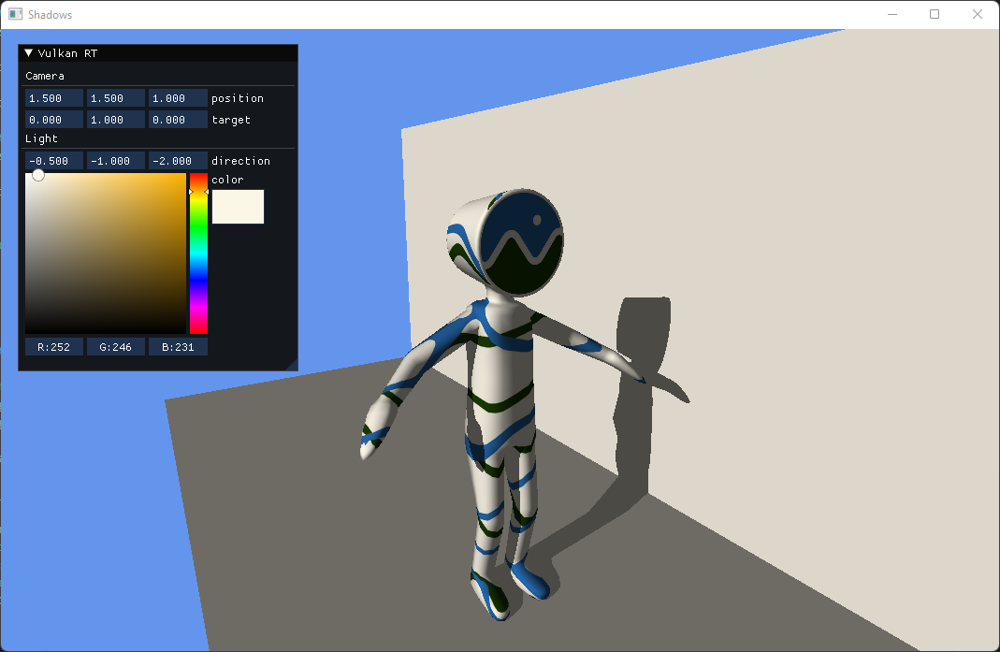

# vulkan-raytracing-rs

Vulkan ray tracing in Rust with [ash][ash].



## Examples

You can run one of the following example.

- triangle_basic: Ray traced triangle with simple Vulkan setup (no frames in flight) and all code in one file.
- triangle_advanced: Ray traced triangle with a Vulan setup a bit more involved and using some abstractions.
- shadows: Raytraced gltf model with simulated sunlight shadow. It has one BLAS with multiple geometries. Light and camera controls with imgui.
- reflections: Iterative (not recursive) reflections.

```ps1
# Powershell example (all scripts have a .sh version)

# Compile all glsl shaders to spir-v 1.4
.\scripts\compile_shaders.ps1

# Enable validation layers and set log level to debug
.\scripts\debug.ps1 triangle_basic

# Compiles with --release and set log level to info
.\scripts\run.ps1 triangle_basic
```


## Useful links

- [NVidia tutorial](https://nvpro-samples.github.io/vk_raytracing_tutorial_KHR/)
- [SaschaWillems' Vulkan](https://github.com/SaschaWillems/Vulkan)

[ash]: https://github.com/MaikKlein/ash
